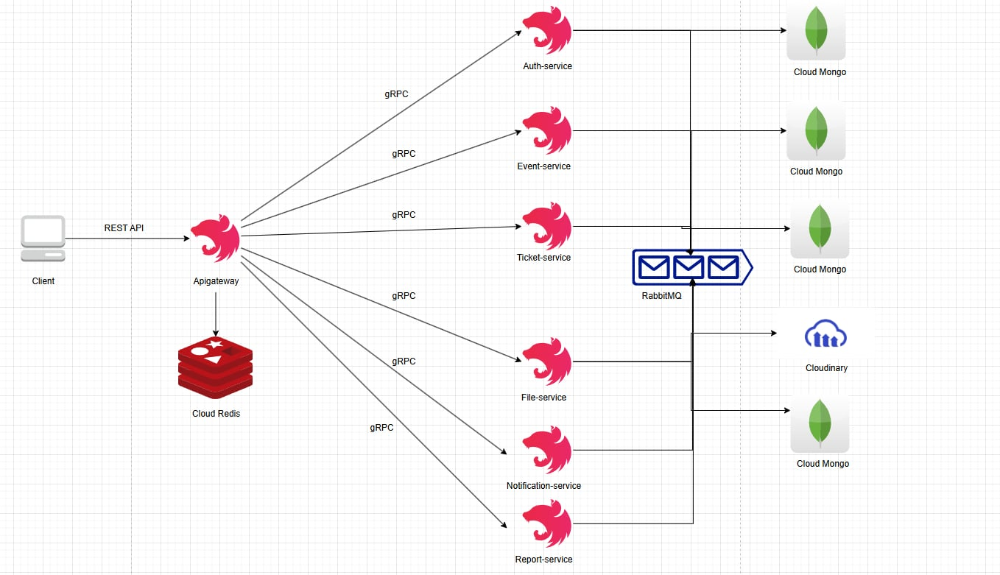
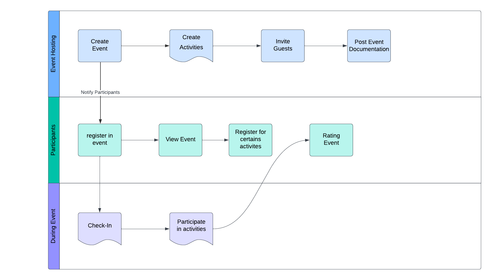

# This is the IT Project By PASA Software Team
## Account
- Account (or sign up, sign in with google)
  - **User 1:**
  - email: user8@gmail.com
    password: password123
  - **User 2:**
  - email: user1@example.com
    password: password123

## Run on deploy
<b>Run on deploy : </b>
- link deploy FE : https://pasasoftware.site
- link deploy BE : https://api.pasasoftware.site

## Run on local
<b>To run the project locally, please follow these steps.</b>
- run rabbitmq in docker
```bash
docker run -d --hostname my-rabbit --name some-rabbit -p 5672:5672 -p 15672:15672 -p 15692:15692 -e RABBITMQ_DEFAULT_USER=admin -e RABBITMQ_DEFAULT_PASS=1234 rabbitmq:3-management
```
- FE : cd frontend 
- version: node v22.12.0, yarn 1.22.22
```bash
yarn install
yarn dev
```
- url FE : http://localhost:5173

- BE : cd backend 
- in backend\apps\apigateway\src\main.ts replace "origin: ["https://pasasoftware.site"]" to "origin: ["http://localhost:5173"]"
- in backend\apps\apigateway\.env.example replace to:
```bash
REDIS_HOST=redis-10701.c295.ap-southeast-1-1.ec2.redns.redis-cloud.com
REDIS_PORT=10701
REDIS_PASSWORD=wNNnPwxAjaO5RuN3mT7rUjBC6twXfrUu
```
- version: node v22.12.0, yarn 1.22.22, nest 9.4.2
```bash
yarn install
yarn start:all
```

## Run unit test
<b>run unit test for BE</b>
```bash
yarn test:unit
```

## Desigining System Business Logic & Materials
Overall Use Cases

Backend

Business Flow

