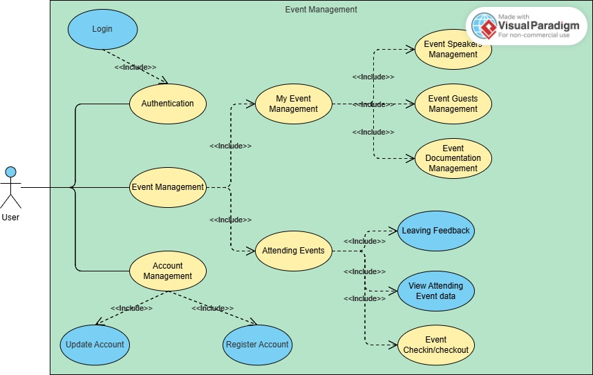

# This is the IT Project By PASA Software Team

## Overview
<b>Following Stacks : </b>
- Front-end
  - ReactJS (Vite Build Tool)
- Backend
  - FastAPI By Python
## Desigining System Business Logic & Materials

### 1. Event Management
An event may have theses properties associated with it:
- speakers of the event.
- invited guests of the event.
- event documentation.
  - files like pdf.files images files and video files
- Location
- Short description
- Event Category
- Start Date - End Date
- Capacity
- Event Status
### 2. User
- `id` (int): Unique identifier for the user.
- `name` (string): Full name.
- `email` (string): Contact email.
- `password` (hashed): Password for authentication.
- `createdAt` (datetime): Timestamp of user creation.
- `updatedAt` (datetime): Timestamp of last update.
- `isTemporary` (boolean): Indicates if the account is temporary or pending activation.
### 3. Event Registration
3. Registration (or Application)
Defines the relationship between users and their roles in specific events.
- `id` (int): Unique identifier for the registration.
- `eventId` (int): Foreign key to the associated Event.
- `userId` (int): Foreign key to the associated User.
- `role` (enum): Role of the user in the event (e.g., "Organizer", "Speaker", "Attendee", "Guest").
- `status` (enum): Status of the registration (e.g., "Pending", "Approved", "Rejected").
- `registeredAt` (datetime): Timestamp of registration.

  
<strong>Note:</strong> <b>Speakers</b> and <b>Guests</b> are the User which have registered in the system or can be added

  <!-- 
It can have multiple lines.
 -->

